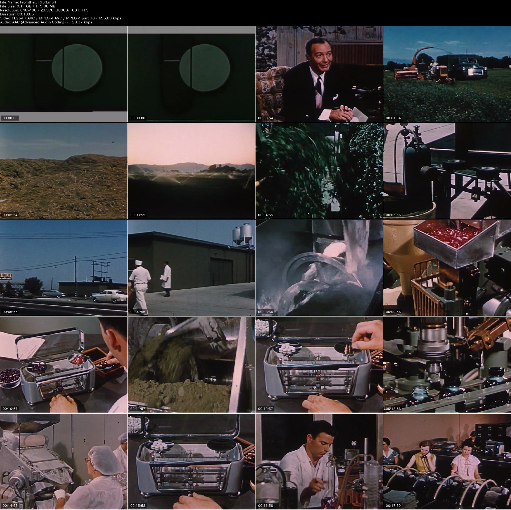

# Video Thumbnailer

動画ファイルをサムネイルカタログにするツールです．

 
<cite> [From the Ground Up : Unknown : Free Download, Borrow, and Streaming : Internet Archive](https://archive.org/details/FromtheG1954)</cite>

* macOSで動作確認しています
* 日本語のファイル名に対応しています
* 事前に[ImageMagic](https://imagemagick.org/index.php)と[FFmpeg](https://ffmpeg.org/)のインストールが必要です

## 準備

ImageMagicとFFmpegをインストールしてください．
Homebrewを使っている場合は，以下のコマンドでインストールできます．

```bash
$ brew install imagemagick
$ brew install ffmpeg
```

動作確認できているバージョンは以下のとおりです．

* ImageMagick 7.0.9
* ffmpeg: 4.2.2

## 使い方

動画ファイルとサムネイルの行列数を引数に起動します．
[こちらのパブリックドメイン動画](https://archive.org/details/FromtheG1954)を変換してみました．

```bash
$ curl -Lo FromtheG1954.mp4 https://archive.org/download/FromtheG1954/FromtheG1954.mp4
$ ./video-thumbnailer 4 5 FromtheG1954.mp4
```

処理が完了すると，冒頭のようなサムネイル画像 FromtheG1954.jpg ができあがります．

## カスタマイズ

### サムネイル画像サイズ

デフォルトは横1920pxで生成されます．
変更したい場合は，スクリプト中の`THUMBNAIL_WIDTH`を変更してください．

### フォント

メタ情報をヘッダ部に画像化するために，[IPAフォント](https://ipafont.ipa.go.jp/old/ipafont/download.html)を使っています．
異なるフォントを使いたい場合は，スクリプト中の`FONT_FILE`を変更してください．

